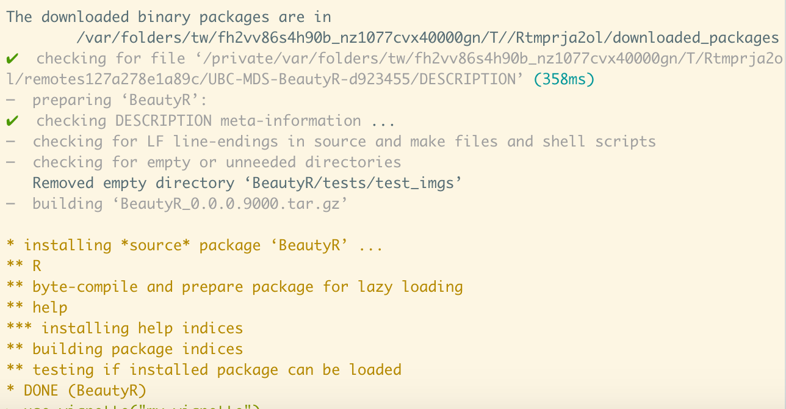
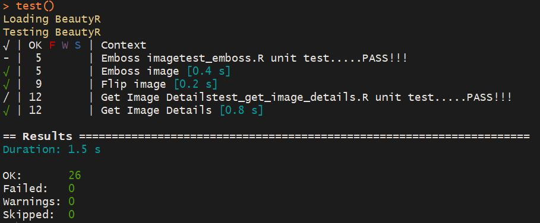
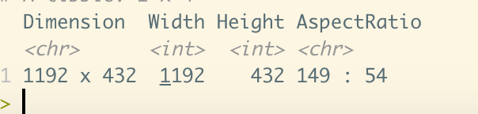
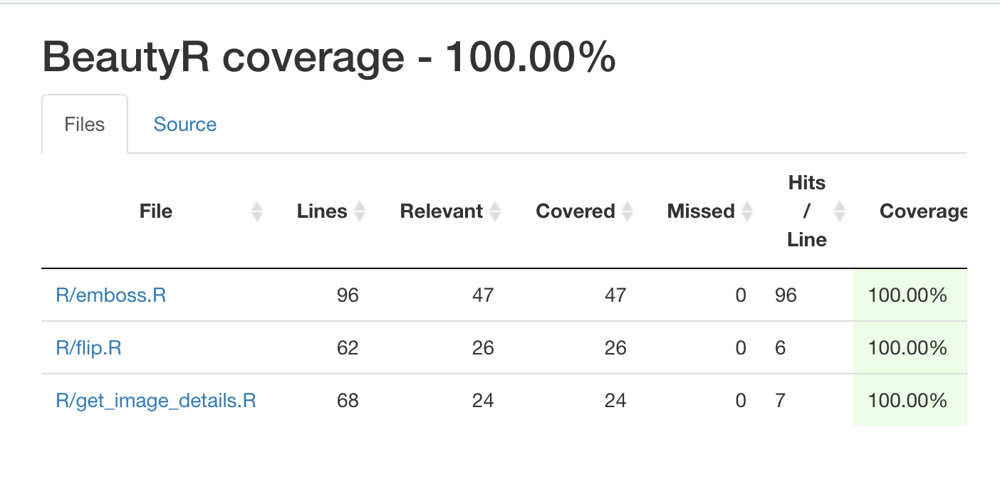

# BeautyR

[](https://travis-ci.org/UBC-MDS/BeautyR)

[](https://codecov.io/github/UBC-MDS/BeautyR?branch=master)


Image processing in R.

## Contributors

[Gilbert Lei](https://github.com/gilbertlei)

[Jielin Yu](https://github.com/jielinyu)

[Olivia Lin](https://github.com/olivia-lin)

## Overview
Nearly everyone has some experience with Image processing, which is around our daily life. For example, when we use iPhone's camera to take pictures, it allows us to choose a filter which can add some special effects on these pictures. While using these filters, people might have wondered how these special effects are realized.

We developed this package that performs digital image processing on .JPG images. People can use it to transform images into new images with some special effects, such as embossing, to compress images to reduce file sizes, and to calculate the exact number of bytes an image has. We hope to advance and add more functions later on.

## Functions
#### Emboss

This function turns a colorful image into an embossment-type image. It replace each pixel of the image by either a highlight or a shadow. Low contrast areas are replaced by a gray background.

This function embosses the original image and saves the embossed image to output_path.

*Parameters:*  
- input_path: `character` The file path for the original image we want to emboss.  
- output_path: `character` The file path to save the embossed image.

*Return:*   
- An embossed image will be saved in output path.


#### Flip

This function flips the images either vertically or horizontally and save it to the output path.

*Parameters:*  
- input_path: `character` The file path for the original image we want to flip.
- output_path: `character`  The file path to save the flipped image.
- direction: `character` Direction to flip, "h" or "v", which represents horizontal and vertical respectively.

*Return:*  
- An flipped image file will be saved in output path.


#### Get_Image_Details

This function returns attributes of the input image, such as dimension, width, height and aspect ratio. Users can choose the attributes they want to look at by specify the name of attribute.

*Parameters:*  
- input_path: `character` The file path for the image we want to return information of.
- detail: `character` The name of attribute that the function will return. Default set to be 'All'. Available choices are: 'All', 'Dimension', 'Width', 'Height', and 'Aspect Ratio'.

*Return:*  
- A data frame that has the detailed information about input image.


## Installation
To install the package, you need devtools.
Firstly, check if devtools has been installed on your computer. If not, open an R console and run the following command line:
```
install.packages("devtools") to install devtools.
```

Then, run the following command line in the R console:
```
devtools::install_github("UBC-MDS/BeautyR", build_vignettes = TRUE)
```



## Run Tests

```
library(devtools)
load_all()
test()
```



## Usage


#### Emboss an image
```
>> library(BeautyR)
>> emboss("img/Google-logo.jpg", "img/Google-logo_emboss.jpg")
```


#### Flip an image  
```
>> library(BeautyR)
>> flip("img/Google.png", "img/Google_flip.png", "h")  
```


#### Get details of an image  
```
>> library(BeautyR)
>> get_image_details("img/Google.png")
```


#### To check code coverage
```
library(covr)

report()
```


## Where does this package fit into the R ecosystem

While there are many R packages that provide image processing functions such as blurring, sharpening, grayscalling, etc., we didn't find any existing R package that provide an image emboss function. As such, we decided to develop an emboss tool that could process an image file and output the embossed version of it. At the same time, we wanted to gain deeper understanding of neural network by coding an emboss filter algorithm.   


For image flipping (mirroring), there are several packages available in the R ecosystem. One example is the `mirror` function from [imager](https://cran.r-project.org/web/packages/imager/vignettes/gettingstarted.html) package. However, imager's `mirror` function works on an array, instead of an image file saved on a computer. So we decided to develop a `flip` tool that can read in a real image file and save the flipped image as another real file on computer.


For getting image details, we didn't find any existing package/function that could work as we expected. We believe our `get_image_details` will be a good function to have for the R ecosystem.
